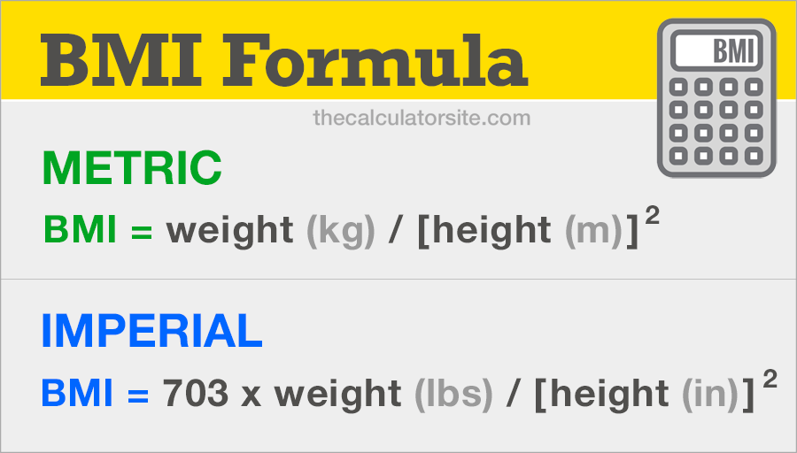

# The effect of BMI (Body Mass Index) with medal earning in each country.

## At glance

Refer to care point health US, body mass index (BMI) is a guideline used by health professionals and bariatric surgeons to determine the overall health of an individual in terms of weight and body fat. BMI is calculated using a ratio of your height and weight, and can be affected by how often you exercise and by the types of foods you eat. Those who have above-average BMIs that fall into the overweight and obese categories can take steps to become healthier through diet, exercise, and weight-loss surgery so they can improve their overall quality of life and live longer with fewer health complications.

```{r}
knitr::include_graphics("/Users/pandjibagas/Desktop/Algoritma Course/LBB/Olympic_Athletes/120 Years Olympic History/Body Mass Index.png")
```

From image above, US medical standard categorize people to 5 category by result the BMI, which is underweight (BMI < 18.5), normal (<18.5 < BMI < 24.6), overweight (25 < BMI < 29.9), obese (30 < BMI < 39.9), and morbidly obese (BMI > 40). For the record, the index only apply to adult aged above 20 years.

How about the olympic athletes? Is it all athletes have ideal BMI? or how BMI effect the earning medal?

In this publication will interprets about the effect of BMI in olympic athlete from historical data on the modern Olympic Games, from Athens 1896 to Rio 2016. Each row corresponds to an individual athlete competing in an individual event, including the athlete's name, sex, age, height, weight, country, and medal, and the event's name, sport, games, year, and city. The outputs will exemine the simple distribuiton from all parameters include BMI, categorize athlete by BMI chart shown above, and the correlation BMI with earning medals. Lets gets started!


# Data Wrangling

The core activites from this step are discovering and input, structuring, cleaning, enriching, validating, and analyzing.

## Dicovering & Input Data

The historical data olympic acquaried from mavenanalytic (https://www.mavenanalytics.io/data-playground). The next step input the data with code below,
```{r}
#Load/install library package to read data
library(readxl)

#All packages data for observing the overall data and output
olympic_athlete <- read.csv("athlete_events.csv") #main data
olympic_country <- read.csv("country_definitions.csv") #supporting data
athlete_def <- read.csv("athlete_events_data_dictionary.csv") #definition each coloumn from athlete_events.csv
country_def <-  read.csv("country_definitions_data_dictionary.csv") #definition each coloumn from country_definiitons.csv
```

Show the data

```{r}
#Our main data olympic_athlete
head(olympic_athlete,10)
```
```{r}
#Our supporting data olympic_country
head(olympic_country,10)
```

## Structuring Data

As dataframe shown from olympic_athlete & olympic_country we need to combine both of dataframe because,
1. From business question we must know the frequency each country but the  variable country occur in olympic_country as region column and the detail of athlete in olympic_athlete.
2. To simplify our wrangling and analyze should be in one dataframe.

Merge the data

```{r}
#Merge the data with key column, "NOC"
olympic <- merge(olympic_athlete, olympic_country, by.x = "NOC", by.y = "NOC", all.x = T)
head(olympic,10)
```

Check the data type every column & adjust the type.

```{r}
#Check data type every column
str(olympic)
```
From result above there is several variables that need to change to obtain appropiate output. The variables are NOC, Sex, Height, Weight, Team, Games, Season, City, Sport, Event, Medal, Region and change become factor.

```{r}
olympic[,c("Sex","Team","NOC","Games","Season","City","Sport","Medal","Event","region")] <-
  lapply(olympic[,c("Sex","Team","NOC","Games","Season","City","Sport","Medal","Event","region")], as.factor)
```

## Cleaning Data

This step occur activites to check the completness of data, missing value, and validate the connection between variables.

```{r}
summary(olympic)
```

From summary code, it generates simple aggregation in all variable in each value depends on data type and to peek missing value in variable. Conclusion from the summary are:
1. From variable ID, amount athlete that participate olympic is 135.571
2. From variable Sex, amount Male (196.594) dominate female athlete (74.522)
3. From variable Age, avarage age athlete olympic all the time is 25.56 and have 9.479 missing values. 
4. From variable Height, avarage height athlete olympic all the time is 175.3 and have 60.171 missing values.
5. From variable Weight, avarage weight athlete olympic all the time is 70.7 and have 62.875 missing values.
6. From variable Teams, the top three amount athlete by team's name are United States, France, and Great Britain.
7. From variable Games, the most participant athlete when 2000 Summer Olympic with amount 13.821 athletes.
8. From variable Year, the first olympic held on 1896 and last on 2016.
9. From variable Season, the most season helds olympic is during summer.
10.From variable Sport, the most participate sport is athletics with amount 38.624 athletes.
11. From variable Event, the most participate event is Men's Footbal with amount 5.733 athletes.
12. From variable Medal, the NA's value define the athlete who not earn medal.
13. From variable region, the top three participate athlete by region are USA, Germany, and France.
14. From notes, don't have any info.

Inspection missing value focus on Age, Height, Weight, and region.

Why it's matter? As we know from business question, to calculate BMI we need height, weight, age, and for the output expected we need to compare BMI based on country. 

```{r}
#Load/install library package to filter data
library(dplyr)

#Identifying NA
colSums(is.na(olympic))
```

Delete all row containt NA in variable Age, Height, Weight, and Region

```{r}
#Identifying amount row where's NA in column Age, Height, Weight, Region

#Delete row containt NA based on Age, Height, Weight, Region
olympic <- olympic[!is.na(olympic$Age),]
olympic <- olympic[!is.na(olympic$Height),]
olympic <- olympic[!is.na(olympic$Weight),]
olympic <- olympic[!is.na(olympic$region),]

colSums(is.na(olympic))
```

Replace missing value on Medal variable to No Medal

```{r}
#To replace with string, the data type column should be in character type
no_medal <- olympic$Medal
no_medal <- as.character(no_medal)
no_medal[is.na(no_medal)] <- "No_Medal"
no_medal <- as.factor(no_medal)
olympic$Medal <- no_medal

colSums(is.na(olympic))
```

Remove notes column

```{r}
olympic$notes <- NULL
```

Summary all data once again for final check

```{r}
summary(olympic)
nrow(olympic)
```


## Enriching

As the output expected there is two columns that should be add and show, first column is Body Mass Index (BMI). The formula to calculate BMI :
```{r}

```

Add and calculate BMI

```{r}
#remember height in m not cm
olympic <- olympic %>%
  mutate(BMI = Weight/(Height/100)^2) %>%
  mutate_at(vars(BMI), funs(round(., 2)))
  
head(olympic)
```

Second column is for to categorize the BMI based on BMI chart.

```{r}
olympic <- olympic %>%
  mutate(BMI_category = case_when(BMI < 18.5 ~ "Underweight",
                                  BMI <= 24.9 ~ "Normal",
                                  BMI <= 29.9 ~ "Overweight",
                                  BMI <= 39.9 ~ "Obese",
                                  BMI >39.9 ~ "Morbidly Obese"))

olympic[,c("BMI","BMI_category"),]
```

Transform value in variable medal to column and give total of medal each athlete

```{r}
library(tidyr)
olympic <- olympic %>%
  pivot_wider(
    names_from = Medal,
    values_from = Medal,
    values_fn = length,
    values_fill = 0) %>%
  mutate(Total_Medal = Bronze + Silver + Gold)

olympic$No_Medal <- NULL

olympic
```

```{r}

```


## Validating

This step prevent anomaly data before we processing, to do so we will aggregate and subset.
As our business question we will focus on the BMI & medal

Check outlier

Groupby by ID because the unique keys

```{r}
#olympic_check_outlier
library(ggplot2)
olympic %>%
  filter(region == "USA", Sport == "Athletics", Sex == "M") %>%
  group_by(Year, ID) %>%
  summarise(Bronze = sum(Bronze),
            Silver = sum(Silver),
            Gold = sum(Gold),
            All_Medal = sum(Total_Medal),
            BMI = mean(BMI)) %>%
  mutate(BMI_cat = case_when(BMI < 18.5 ~ "Underweight",
                                  BMI <= 24.9 ~ "Normal",
                                  BMI <= 29.9 ~ "Overweight",
                                  BMI <= 39.9 ~ "Obese",
                                  BMI >39.9 ~ "Morbidly Obese")) %>%
            
  ggplot(mapping = aes(x = BMI , y = as.factor(Year))) +
  geom_jitter(aes(col = BMI_cat)) +
  geom_boxplot(fill = "Gray", alpha = 0.5) +
  labs(title = "Olympic Athlete BMI by Year",
       subtitle = "Male Athlete",
       y = "Year", x ="BMI",
       col = "BMI Category")

```

```{r}
unique(olympic$Sport[olympic$region == "Indonesia"])
unique(olympic$Event[olympic$Sport == "Athletics" & olympic$region == "Indonesia"])
```


```{r}
olympic_history <- olympic %>%
  #filter(region == "Australia") %>%
  group_by(Year) %>%
  summarise(Olympian = n(),
            BMI = mean(BMI),
            Medal = sum(Total_Medal)) %>%
  
  ggplot(aes(x = Year)) +
  geom_col(aes(y = Olympian * 10), fill = "Gray", width = ) + 
  #geom_point(aes(y = Olympian * 10), shape=21, color="black", fill="#69b3a2", size=3) +
  
  geom_line(aes(y = Medal * 50), color = "#f4c300") +
  geom_point(aes(y = Medal * 50), shape=21, color="black", fill="#69b3a2", size=3) +

  geom_line(aes(y = BMI * 1000), color = "#f4c300") +
  geom_point(aes(y = BMI * 1000), shape=21, color="black", fill="#69b3a2", size=3) +
  
  scale_y_continuous(sec.axis = sec_axis(~./10, name = "Relative humidity [%]")) +
  scale_y_continuous(sec.axis = sec_axis(~./50, name = "Relative humidity [%]")) +
  scale_y_continuous(sec.axis = sec_axis(~./1000, name = "Relative humidity [%]"))

  
ggplotly(olympic_history)
  
 

```

```{r}
olympic_history <- olympic_athlete %>%
  #filter(region == "Australia") %>%
  group_by(Year) %>%
  summarise(Olympian = n()) %>%
            #BMI = mean(BMI),
            #Medal = sum(Total_Medal)) %>%
  
  ggplot(aes(x = Year)) +
  geom_col(aes(y = Olympian), fill = "Gray", width = 2) 
  geom_point(aes(y = Olympian * 10), shape=21, color="black", fill="#69b3a2", size=3) +
  
  geom_line(aes(y = Medal * 50), color = "#f4c300") +
  geom_point(aes(y = Medal * 50), shape=21, color="black", fill="#69b3a2", size=3) +

  geom_line(aes(y = BMI * 1000), color = "#f4c300") +
  geom_point(aes(y = BMI * 1000), shape=21, color="black", fill="#69b3a2", size=3) +
  
  scale_y_continuous(sec.axis = sec_axis(~./10, name = "Relative humidity [%]")) +
  scale_y_continuous(sec.axis = sec_axis(~./50, name = "Relative humidity [%]")) +
  scale_y_continuous(sec.axis = sec_axis(~./1000, name = "Relative humidity [%]"))

  
ggplotly(olympic_history)
```

```{r}
olympic_boxplot <- olympic %>%
            #filter(region == input$Select_region, Sport == input$Select_Sport, Event == input$Select_Event) %>%
            group_by(Year, ID) %>%
            summarise(Bronze = sum(Bronze),
                      Silver = sum(Silver),
                      Gold = sum(Gold),
                      All_Medal = sum(Total_Medal),
                      BMI = mean(BMI)) %>%
            mutate(BMI_cat = case_when(BMI < 18.5 ~ "Underweight",
                                       BMI <= 24.9 ~ "Normal",
                                       BMI <= 29.9 ~ "Overweight",
                                       BMI <= 39.9 ~ "Obese",
                                       BMI >39.9 ~ "Morbidly Obese"))
            
        olympic_boxplot <- ggplot(olympic_boxplot, mapping = aes(y = BMI , x = Year)) +
            geom_jitter(aes(col = BMI_cat)) +
            geom_boxplot(fill = "Gray", alpha = 0.5) +
            labs(title = "Olympic Athlete BMI by Year",
                 subtitle = "Male Athlete",
                 x = "Year", y ="BMI",
                 col = "BMI Category")
        
        ggplotly(olympic_boxplot)
```


```{r}
scl <- 0.01

```


```{r}
library(ggplot2) #package to create plot

#suspect BMI outlier from Sex variable in all athlete by each year
outlier_BMI_M <- olympic %>%
  filter(Sex == "M") %>%
  select(Name, Sex, Sport, Event, Year, Age,Weight, Height, BMI, BMI_category) %>%
  
  ggplot(mapping = aes(x = BMI , y = as.factor(Year))) +
  geom_jitter(aes(col = BMI_category)) +
  geom_boxplot(fill = "white") +
  labs(title = "Olympic Athlete BMI by Year",
       subtitle = "Male Athlete",
       y = "Year", x ="BMI",
       col = "BMI Category")

outlier_BMI_M


```
```{r}
outlier_BMI_F <- olympic %>%
  filter(Sex == "F") %>%
  select(Name, Sex, Sport, Event, Year, Age,Weight, Height, BMI, BMI_category) %>%
  
  ggplot(aes(x = BMI , y = as.factor(Year))) +
  geom_jitter(aes(col = BMI_category)) +
  geom_boxplot(aes(fill = "white")) +
  labs(title = "Olympic Athlete BMI by Year",
       subtitle = "Female Athlete",
       y = "Year", x ="BMI",
       col = "BMI Category")

outlier_BMI_F
```
Outlier cannot be trace just from Gender variable, it's because the amount participant athlete each sport have different height & weight requirement. Example wrestling avarage BMI higher but have athlete participant fewer than badminton, it's because rules wrestling sport require weight over 80 kg.

So next step is inspect outlier in sport every year.

```{r}
  #Example Judo Sport
  olympic %>%
  filter(Sport == "Judo") %>%
  select(Name, Sex, Sport, Event, Year, Age,Weight, Height, BMI, BMI_category) %>%
  
  ggplot(aes(x = as.factor(Year), y = BMI)) +
  geom_jitter(aes(col = BMI_category)) +
  geom_boxplot(fill = "white") +
  labs(title = "Olympic Athlete BMI by Year",
       subtitle = "Judo Sport",
       y = "Year", x ="BMI",
       col = "BMI Category")
```

Distribution of Data based on BMI

```{r}
library(tidyverse)
library(hrbrthemes) 

BMI_dist <- olympic %>%
  filter(Sex == "M" | Sex == "F") %>%
  select(Name, Sex, Sport, Event, Year, Age,Weight, Height, BMI, BMI_category) %>%
  
  ggplot(aes(x = BMI)) +
  geom_histogram(aes(bins=10, fill="blue" , color="blue", alpha=0.5)) +
  labs(title = "Olympic Athlete BMI Distribution",
       x ="BMI") +
  scale_fill_brewer(palette="PuBu") +
  theme(legend.position = "NONE") +
  facet_wrap(~Year, scales = "free_y")
  

BMI_dist
```
As histogram plot shown the BMI distribution in athelete each olympic every year at range 20 -30 or normal to overweight. Overall the distribution BMI's is normal distribution.


# Analyze

## Historical Olympic 1986 - 2016
```{r}
library(ggplot2)
library(dplyr)
library(babynames)
library(viridis)
library(hrbrthemes)
library(plotly)

olympic %>%
  filter(region == "Australia") %>%
  group_by(Year) %>%
  summarise(Olympian =n(),
            Medal = sum(Total_Medal),
            Avg_BMI = round(mean(BMI),2)) %>%

  ggplot(aes(x= Year)) +
  geom_line(aes(y = Olympian)) + 
  geom_line(aes(y = Medal)) +
  geom_line(aes(y =Avg_BMI))
```


```{r}
geom_area(aes(y= Medal, fill="Red", text="")) +
    scale_fill_viridis(discrete = TRUE) +
  
  geom_area(aes(y= Olympian, fill="Blue", text="")) +
    scale_fill_viridis(discrete = TRUE) +
  
    theme(legend.position="none") +
    ggtitle("Popularity of American names in the previous 30 years") +
    theme_ipsum() +
    theme(legend.position="none")
```


```{r}
str(olympic)  
```


## How many athlete in every country?

```{r}
olympic_raw <- merge(olympic_athlete, olympic_country, by.x = "NOC", by.y = "NOC", all.x = T)

athlete_participant <- olympic_raw %>%
  filter(Year == 2016) %>%
  group_by(region, Sex) %>%
  summarise(ID = n_distinct(ID)) %>%
  head(30) %>%
  ggplot(aes(x = reorder(region, -ID), y = ID)) +
  geom_col(aes(fill = Sex)) +
  scale_fill_brewer(palette="PuBu")

ggplotly(athlete_participant)

```

## Participant Athlete by Gender

```{r}

athlete_gender <- olympic %>%
  filter(region == "Argentina", Year == 2016) %>%
  group_by(Sex) %>%
  summarise(ID = n_distinct(ID)) %>%
  mutate(percent = ID/sum(ID)*100) %>%
  mutate_at(vars(percent), funs(round(., 0))) %>%
  mutate(ypos = cumsum(percent)- 0.5*percent ) %>%
  
  ggplot(aes(x = "", y = percent, fill = Sex)) +
  geom_bar(stat="identity", width=1, color="white") +
  coord_polar("y", start= 0) +
  theme_void() +
  geom_text(aes(y = ypos, label = percent), color = "black", size=5) +
  scale_fill_brewer(palette="PuBu")

athlete_gender
  
```
## Avarage BMI category each country

```{r}
athlete_gender <- olympic_raw %>%
  filter(Year == 2016) %>%
  group_by(Sex) %>%
  summarise(ID = n_distinct(ID)) %>%
  mutate(percent = ID/sum(ID)*100) %>%
  mutate_at(vars(percent), funs(round(., 0))) %>%
  mutate(ypos = cumsum(percent)- 0.5*percent ) %>%
  
  
```


## How Country Effect the BMI

```{r}
olympic %>%
  filter() %>%
  group_by(region) %>% 
  summarise(avg_age = mean(Age),
            avg_height = mean(Height),
            avg_weight = mean(Weight),
            avg_BMI = mean(BMI)) %>%
  mutate(BMI_cat_country = case_when(avg_BMI < 18.5 ~ "Underweight",
                                  avg_BMI <= 24.9 ~ "Normal",
                                  avg_BMI <= 29.9 ~ "Overweight",
                                  avg_BMI <= 39.9 ~ "Obese",
                                  avg_BMI >39.9 ~ "Morbidly Obese")) %>%
  arrange(-avg_age) %>%
  head(30) %>%
  ggplot(aes(y= reorder(region,avg_BMI), x = avg_BMI)) +
  geom_col(aes(fill = BMI_cat_country)) +
  scale_fill_brewer(palette= 14) +
  theme(panel.grid.major = element_blank(), panel.grid.minor = element_blank(), panel.background = element_rect(fill = "white"))
  

```
As data shown two region have BMI with overweight category. So we must zoom the data to know which sport contribute high BMI

```{r}
#American Samoa
olympic %>%
  filter(region == "American Samoa") %>%
  select(ID, Name, Sex, Sport, Event, Year, Age,Weight, Height, BMI, BMI_category) %>%
  ggplot(aes(x = reorder(Sport,-BMI), y = BMI)) +
  geom_col(aes(fill = BMI_category), position = "dodge") +
  scale_fill_brewer(palette="PuBu")
           

```
In region American Samoa Wrestling, Archery, and Sport are contributor high BMI with Obese category.

```{r}
olympic %>%
  filter(region == "American Samoa", Sport == "Wrestling") %>%
  select(ID, Name, Sex, Sport, Event, Year, Age,Weight, Height, BMI, BMI_category) %>%
  arrange(BMI)
```

## Is it more ideal BMI get more earning medal?

Check distribution

```{r}

olympic %>%
  group_by(ID) %>%
  summarise(medal_id = sum(Total_Medal), avg_BMI = mean(BMI)) %>%
  mutate(BMI_cat = case_when(avg_BMI < 18.5 ~ "Underweight",
                                  avg_BMI <= 24.9 ~ "Normal",
                                  avg_BMI <= 29.9 ~ "Overweight",
                                  avg_BMI <= 39.9 ~ "Obese",
                                  avg_BMI >39.9 ~ "Morbidly Obese")) %>%
  
  ggplot(aes(avg_BMI, medal_id)) +
  geom_point(aes(col = BMI_cat))
  
  
```
From the scatter plot we see the ideal BMI prefer to get more earning medal. But is it true the two variable have correaltion?

Check correlation
```{r}

library(ggpubr)

  olympic_corr <- olympic %>%
  group_by(ID) %>%
  summarise(medal_id = sum(Total_Medal), avg_BMI = mean(BMI)) %>%
  mutate(BMI_cat = case_when(avg_BMI < 18.5 ~ "Underweight",
                                  avg_BMI <= 24.9 ~ "Normal",
                                  avg_BMI <= 29.9 ~ "Overweight",
                                  avg_BMI <= 39.9 ~ "Obese",
                                  avg_BMI >39.9 ~ "Morbidly Obese")) %>%
  filter(BMI_cat == "Normal")

  ggplot(olympic_corr, aes(avg_BMI, medal_id)) +
  geom_point(aes(col = BMI_cat)) +
  geom_smooth(method = lm, se = TRUE)
  
```

```{r}
  cor(olympic_corr$medal_id,olympic_corr$avg_BMI)
```

Finaaly the result is no correlation. The conclusion are =
1.
2.
3.


